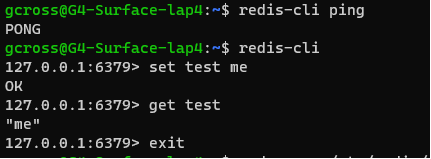

# Redis-HelloWorld

Overview - Hello World application for a Redis Server

Prerequisites
- Install Redis Server
- install node.js

Run the application
```bash
  node redis-hello-world.js
```

## Results


## Notes
- It was easy to install and configure the Redis server
- inserting and retrieving data via node.js was easy
